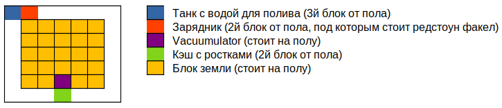
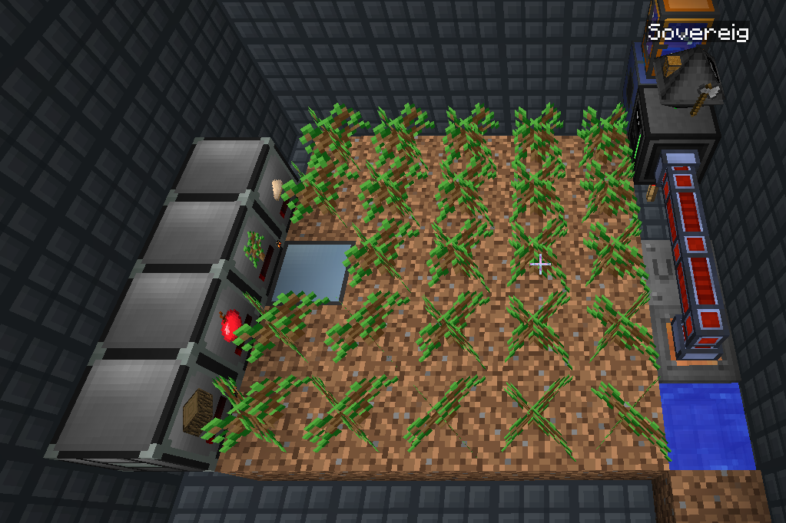

# Автоматизация ручного труда в Compact Claustrophobia

Для работы требуется робот *(а лучше два или три)* следующей конфигурации:

* Computer Case Tier 2
* Inventory Upgrade
* Inventory Controller Upgrade
* Screen Tier 1
* Keyboard
* Graphics Card Tier 1
* CPU Tier 1
* Memory Tier 1 x 2
* EEPROM (LUA)
* HDD Tier 1
* Disk Drive (опционально; для начальной установки системы)
* Upgrade Container Tier 2 (опционально; в дальнейшем можно установить Angel Upgrade)


Обратите внимание, что если у робота нет загрузочного устройства, то работать он не сможет. 

## Автоматизация Field Projector

Установите Charger и робота согласно схеме:

1. Charger должен находиться в двух блоках слева от левого верхнего угла рабочей зоны проекторов.
2. Робот должен смотреть в сторону Charger и находиться в одном блоке от рабочей зоны.


Скопируйте [один из скриптов](builder/) с постройкой в буфер обмена, включите робота и в терминале введите:

```bash
cat > my_script.lua
```

Затем нажмите клавишу `Insert`, чтобы вставить текст программы. Как только вставка закончится, нажмите 
`Ctrl + D`, чтобы завершить операцию. После этого можно запускать программу:

```
./my_script.lua 20
```

Где `20` - количество повторений постройки.

### Особенности работы схемы

* Charger для работы помимо энергии требует Redstone-сигнал, иначе он не будет заряжать робота.
* Робот перед постройкой проверяет наличие материалов в нужном количестве и не начёт работу, если чего-то не хватает.
* Если робот встретит какое-то препятствие, не сможет поставить блок или не найдёт нужный материал, то он встанет и
  будет подавать сигналы о помощи, пока проблема не разрешится.
* Для рецепта Wither Skeleton Skull требуется Angel Upgrade. Если его нет, то нужно будет вручную установить вспомогательный
  блок, чтобы робот смог постановить центральный блок глоустоуна, а потом быстро убрать вспомогательный блок.
* Пока робот ждёт завершения рецепта, в него можно подавать ресурсы (правда срабатывает не всегда).


## Ферма дерева / Tree farm

Установите блоки согласно схеме:

1. Поле земли 3х3 в центре комнаты.
2. В правом верхнем углу на высоте двух блоков от пола Charger и робот (смотрит на Charger).
3. В противоположном углу:
   * На высоте одного блока от пола Vacuumulator с выдачей ресурсов вверх (для сбора выпадающих ростков и яблок).
   * Уровнем выше: слева Portable Tank (который стоит на Compact Infinite Water Source), по центру хранилище для дерева, 
     справа хранилище для яблок.
   * Над хранилищем дерева находится хранилище ростков.



Скопируйте [код программы](tree-farm/tree_farm.lua) в буфер обмена, включите робота и в терминале введите:

```
cat > tree_farm.lua
```

Затем нажмите клавишу `Insert`, чтобы вставить текст программы. Как только вставка закончится, нажмите
`Ctrl + D`, чтобы завершить операцию. После этого можно запускать программу:

```
./tree_farm.lua
```

### Особенности работы фермы

* У фермы довольно высокая производительность, следите, чтобы хранилище дерева не переполнилось.
* Если дерево будет забираться из хранилища, то нужно заблокировать тип хранимого материала (поставить 
  замок `Shift + Right click` свободной рукой по кэшу).
* Если источник воды не будет успевать наполнять Tank, то производительность фермы сильно упадёт.
* Робот не использует топоры для рубки дерева (производительности и так хватает, плюс не требуется обслуживание).


